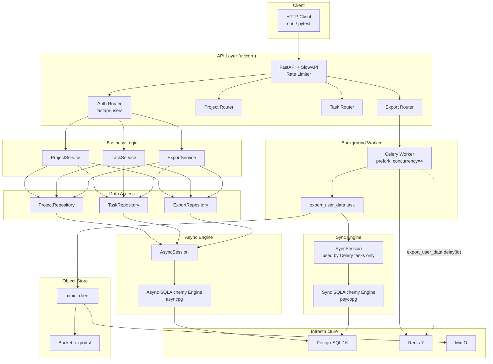
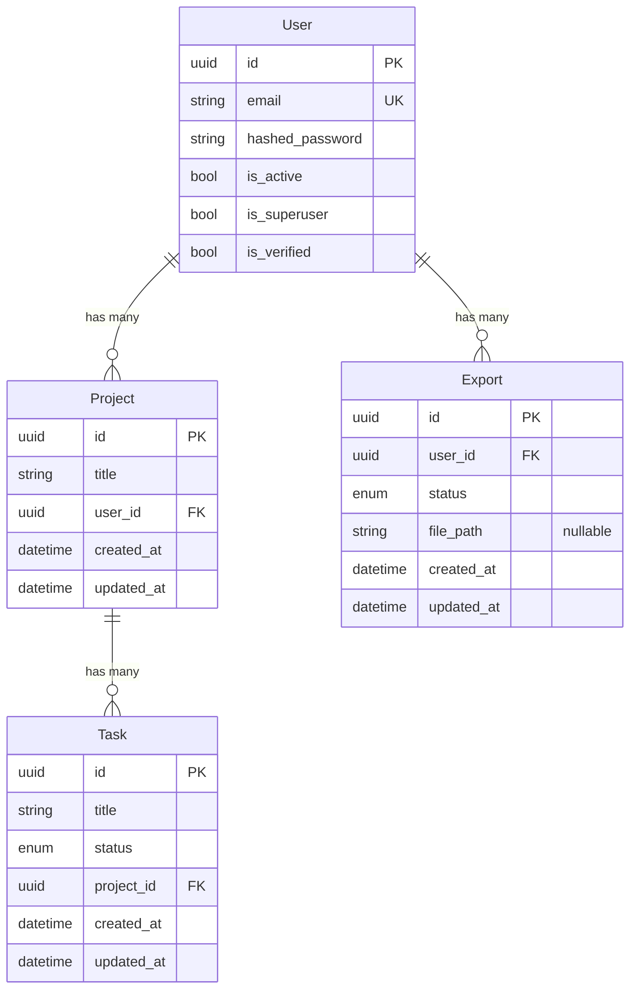
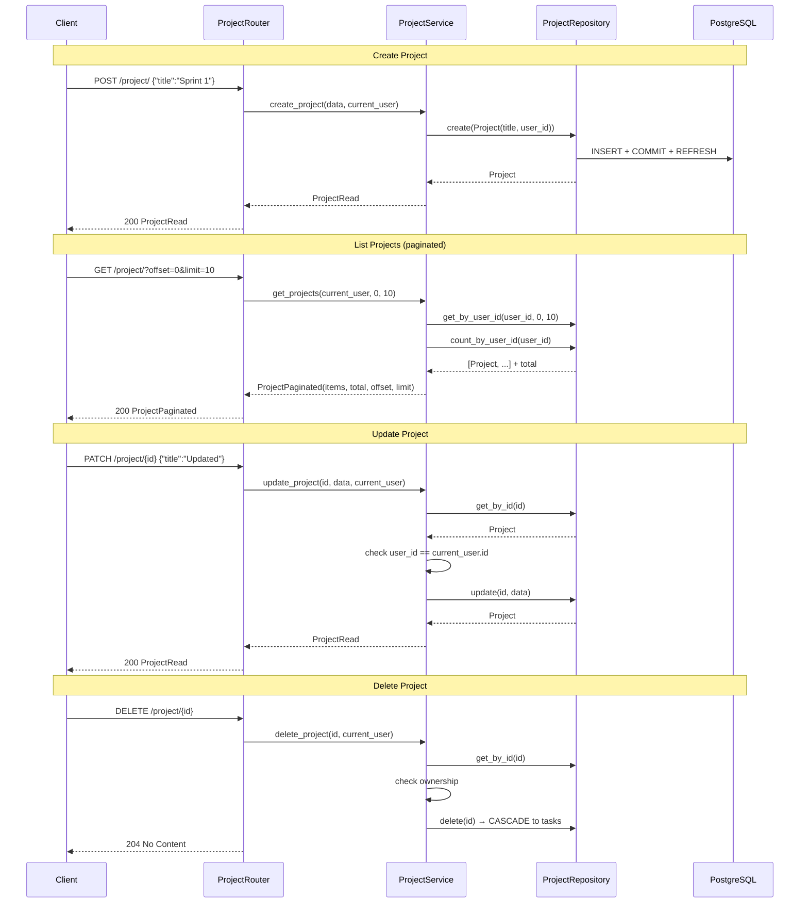
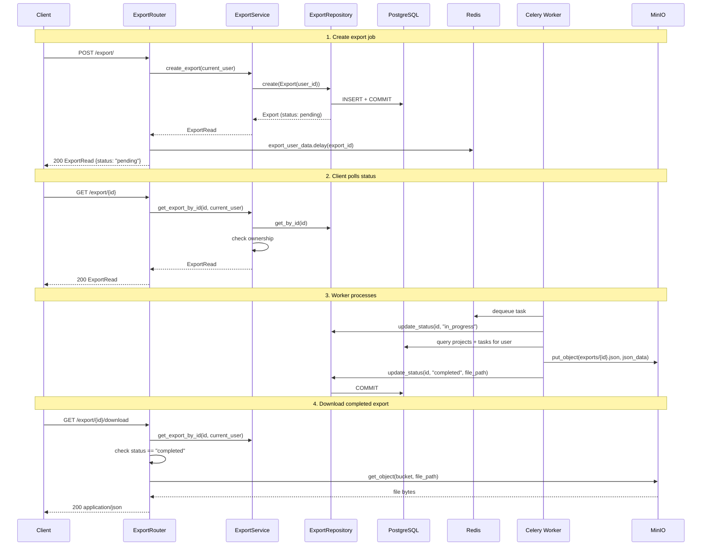

# Design Document

## 1. Architecture

### Layer Responsibilities

| Layer | Role |
|---|---|
| **Routers** (`app/api/routes/`) | HTTP concerns: path/query params, status codes, response serialization |
| **Services** (`app/services/`) | Business logic, authorization checks, orchestration |
| **Repositories** (`app/repositories/`) | Pure data access — CRUD operations on single models |
| **Celery tasks** (`app/tasks/`) | Long-running background jobs with their own sync DB session |
| **Schemas** (`app/schemas/`) | Pydantic models for request validation and response serialization |

---

## 2. Data Model

### Column Details

**`Task.status`** — enum (`String(20)`):

| Value | Meaning |
|---|---|
| `pending` | Default on creation |
| `in_progress` | Manually set by user |
| `completed` | Manually set by user |

**`Export.status`** — enum (`Text`):

| Value | Meaning |
|---|---|
| `pending` | Record created, task enqueued |
| `in_progress` | Celery worker picked up the job |
| `completed` | JSON file uploaded to MinIO; `file_path` populated |
| `failed` | Error during export (worker sets this on exception) |

### Cascade Rules

| Parent → Child | On delete |
|---|---|
| `User` → `Project` | `CASCADE` |
| `User` → `Export` | `CASCADE` |
| `Project` → `Task` | `CASCADE` |

---

## 3. Data Flows

### 3a. Project CRUD

### 3b. Task CRUD

Same pattern as Project, with one extra constraint: **task creation validates parent project exists and belongs to the user**. Tasks are returned in a paginated list scoped to the current user (joined on `Project.user_id`).

### 3c. Export Lifecycle

---

## 4. Authentication

### Mechanism

| Component | Technology |
|---|---|
| Library | `fastapi-users` with SQLAlchemy backend |
| Strategy | JWT (HS256) |
| Transport | Bearer header (`Authorization: Bearer <token>`) |
| Token lifetime | 3600 seconds (1 hour), configurable via `JWTStrategy` |
| Secret | `JWT_SECRET` environment variable |

### Flow

1. **Register:** `POST /auth/register` with `{email, password}` → user inserted into DB → `201` with `UserRead`.
2. **Login:** `POST /auth/jwt/login` with form-encoded `username` + `password` → credentials validated against `hashed_password` → JWT returned.
3. **Authenticated requests:** JWT extracted from `Authorization: Bearer` header, decoded, user fetched from DB via dependency `current_active_user`.
4. **Authorization (resource-level):** Each service method fetches the resource (project/task/export) and compares `resource.user_id` against `current_user.id`. Mismatch → `403`.

### Endpoint Protection

| Endpoint | Middleware/Dependency | Notes |
|---|---|---|
| `/auth/*` | None | Public registration and login |
| `/project/*` | `current_active_user` | All methods require auth |
| `/task/*` | `current_active_user` | All methods require auth |
| `/export/*` | `current_active_user` | All methods require auth |

### Rate Limiting

`slowapi.Limiter` keyed by remote IP is attached to the app via `SlowAPIMiddleware`. A `RateLimitExceeded` exception handler returns a formatted response instead of a raw 500.

---

## 5. Export Job

### Celery Configuration

| Property | Value |
|---|---|
| Broker | Redis at `REDIS_URL` |
| Backend | Redis at `REDIS_URL` |
| Worker pool | `prefork` |
| Concurrency | `4` |
| Task module | `app.tasks.user_tasks` |

### Task: `export_user_data`

1. **Input:** `export_id: str` (UUID as string — Celery serializes kwargs)
2. **Bucket:** Ensured on every run via `ensure_bucket()`.
3. **DB access:** Sync `get_sync_session()` using a separate `psycopg` engine (replaces `+asyncpg` with `+psycopg` in the DATABASE_URL). This avoids the need for async-to-sync bridging in Celery.
4. **Status transitions:** `pending` → `in_progress` (worker starts) → `completed` or `failed` (on exception).
5. **Error handling:** `try/except/finally` block — on failure, status is rolled back to `failed`. Session is always closed.

### Sync vs Async Engines

| Engine | URL scheme | Used by | Session creation |
|---|---|---|---|
| `_engine` (async) | `postgresql+asyncpg://` | API endpoints via `get_async_session()` | Per-request, injected via FastAPI Depends |
| `_sync_engine` (sync) | `postgresql+psycopg://` | Celery tasks via `get_sync_session()` | On-demand in task function |

This duality avoids event-loop conflicts: Celery's prefork workers operate in separate processes and should not share an async engine.

---

## 6. Async Decisions and Assumptions

### Decisions

| Decision | Rationale |
|---|---|
| **Async endpoints (`async def`)** | All route handlers are async to allow concurrency during I/O (DB queries, MinIO calls). FastAPI manages the event loop per request. |
| **Sync Celery tasks** | Celery does not natively support async tasks without third-party extensions. Sync tasks with a psycopg engine are simpler and avoid event-loop lifecycle issues in worker processes. |
| **Two separate SQLAlchemy engines** | The async engine cannot be reused in a synchronous context (Celery). Using separate engines avoids "event loop is already running" errors and keeps each engine's connection pool isolated. |
| **Global engine singletons** | `_engine` and `_sync_engine` are module-level globals in `app/db/session.py`. This simplifies configuration but makes testing harder — tests must use a session-scoped `TestClient` to avoid asyncpg connection conflicts during lifespan enter/exit. |
| **Repository pattern** | Data access is abstracted behind repository classes. This isolates SQLAlchemy queries from service logic, making it possible to swap ORMs or add caching later without changing business code. |

### Assumptions

| Assumption | Implication |
|---|---|
| PostgreSQL with `asyncpg` driver is available | The app will fail to start if PG is unreachable. Health check in `docker-compose.yml` prevents the API from starting before `db` is ready. |
| Redis is available | Celery will fail to connect if Redis is down. The API still works (endpoints don't depend on Celery), but export jobs will queue and never execute. |
| MinIO is available | Export creation succeeds without MinIO (status stays `pending`), but the actual export will fail when the worker tries to upload. |
| `JWT_SECRET` is set | Authentication and JWT signing depend on this. No fallback — the app will crash at startup if the env var is missing. |
| Single-user-per-process for Celery worker | The sync engine's connection pool is configured with defaults. High concurrency on the worker could exhaust connection slots. |
| Tables are auto-created | If the schema changes, existing databases are not migrated — only new tables are added on startup. The `create_all` call uses `checkfirst=True` by default, so existing tables are left untouched. |
